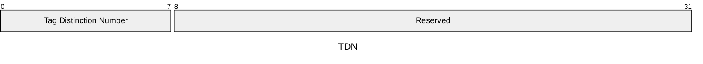
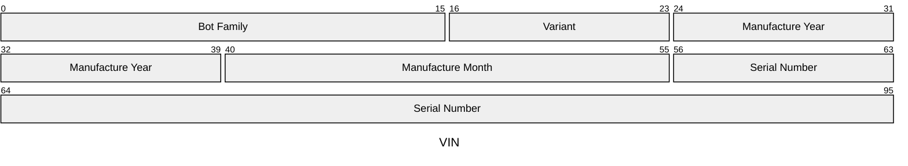
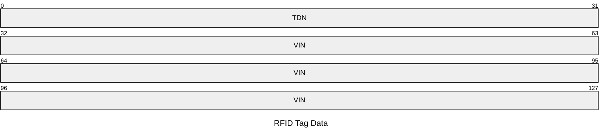

# SymMicro Symbot 1.5 RFID Tags

## Background
The Symbot 1.5 has two RFID tags on the chassis that are used to locate the bot
at various points within the SymMicro structure.  This document details the
data written to the tags and how it interacts with other parts of the SymMicro
system.

### Acronyms
| Acronym   | Definition                       |
|-------    |--------                          |
| SMBG      | SymMicro BotGuardian             |
| STSPLC    | SymMicro Safety PLC              |
| STO       | Safe Torque Off                  |

### Scope
This document applies to the mechanism by which bot RFID tags are read and
encoding of data written to the tags.

### Revisions

#### Revision 1

Initial draft of protocol.

### RFID tag consumers

#### Functional Safety

The Functional Safety system is in charge of reading the RFID tags and
distributing them to the rest of the system.  This is due to a FuSa requirement
that the RFID tags are read in a dual channel manner so that a single fault can
be detected - implemented by using two RFID antennas from different
manufacturers driven by a safety PLC.  The PLC compares the data from both
reads and only exposes it if they are identical.

The BotGuardian (a safety component responsible for commanding bots to enter a
safe state) tracks bot moves across Bot Safety Zones using the data from the
RFID tag.

#### Core Software

Core Software uses the RFID tag data to monitor bot moves across SymMicro
structure levels and for initialization prior to induction.

### Tag Distinction Number
The TDN is an identifier used to distinguish between the pair of RFID tags 
installed on each Symbotic Robot. 

The `Tag Distinction Number` field is 
ASCII encoded with a value of `A` for one tag and `B` for the other. The
safety PLC will use the TDN when comparing RFID data to ensure that each
RFID reader has read a separate tag.

### Vehicle Identification Number
The VIN is a globally unique identifier for a Symbotic robot.  See [Vehicle
Identification Number][vin] Each field is ASCII encoded - the *Variant* is
alphanumeric and all others are numeric.

The VIN is stored separately on each RFID tag and on the Safety CPU EEPROM.  It
is a FuSa requirement that these values are all identical.

## Tag Data

Each RFID tag contains the [Tag Distinction Number](#TagDistinctionNumber) 
and the Symbot [Vehicle Identification Number](#VehicleIdentificationNumber).  
The TDN written to the tags MUST be unique for each tag in a pair.  The VIN 
written to the tags MUST match the VIN written to the Safety CPU EEPROM.  No
checksum is used as these tags are read by separate RFID antennas controlled
by a Safety PLC which guarantees detection of any single fault.

[vin]: https://symbotic.atlassian.net/wiki/spaces/MB/pages/518357157/1.1.3.1+VIN+Vehicle+Identification+Number
