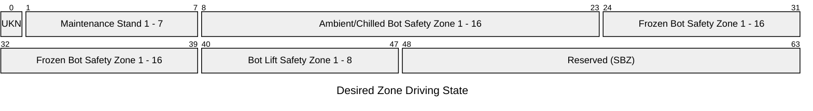
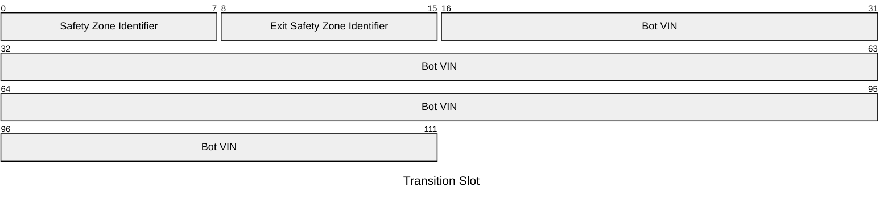
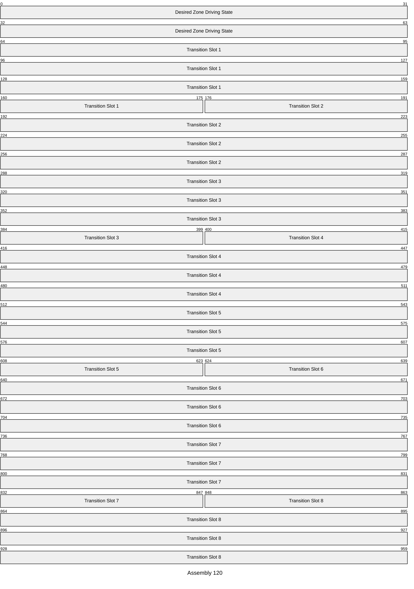
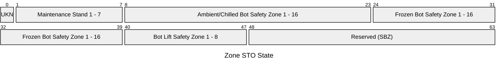
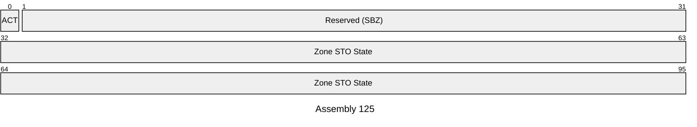
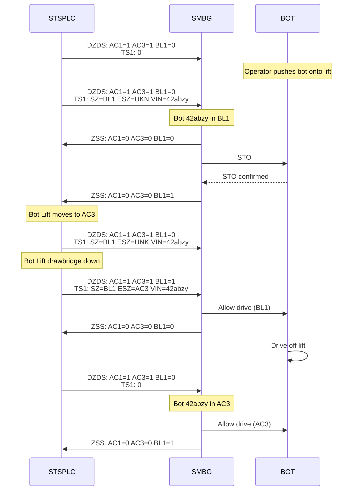
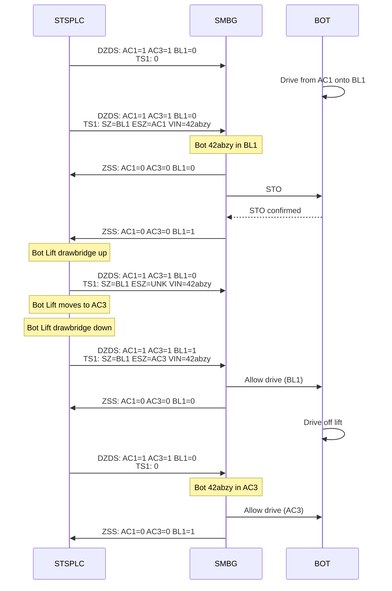
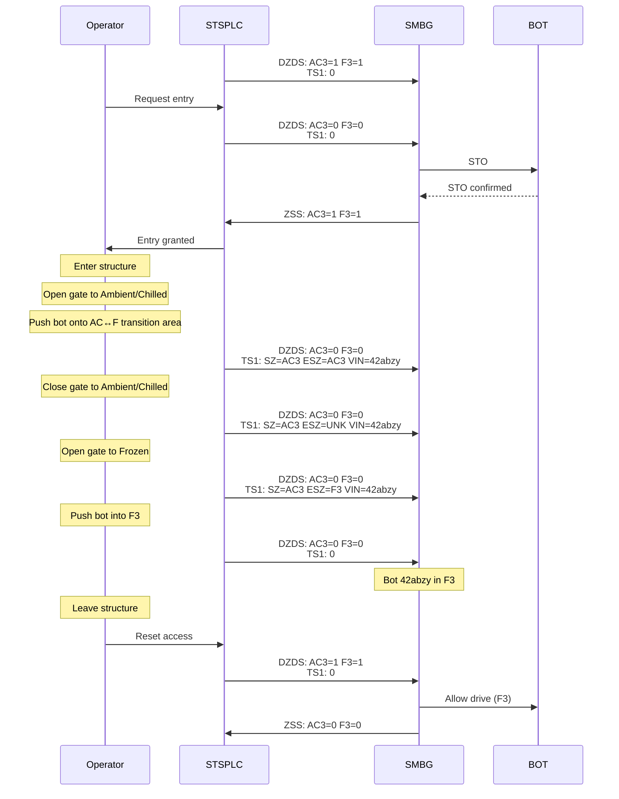

# SymMicro Safety PLC to SymMicro BotGuardian ICD

## Background
The SymMicro Safety PLC is responsible for orchestrating the safety systems
within the SymMicro structure.  SymMicro BotGuardian is a safety system within
the SymMicro structure that is responsible for putting Symbots into a safe
state (safe torque off) within a given zone.  This document details the
communication protocol between the SymMicro Safety PLC and the SymMicro
BotGuardian.

### Acronyms
| Acronym   | Definition                       |
|-------    |--------                          |
| SMBG      | SymMicro BotGuardian             |
| STSPLC    | SymMicro Safety PLC              |
| STO       | Safe Torque Off                  |
| SBZ       | Should Be Zero                   |

### Scope
This document applies to the mechanism and protocol by which the STSPLC and
SMBG communicate.

### Revisions
#### Revision 1
Initial draft of protocol.

### Physical Site and Structure Ownership
As part of the design of this protocol, we wanted to limit knowledge of the
configuration of the physical structure to a single owner.  Not only does a
clear ownership model simplify the configuration of the safety system, but
it also prevents conflicting configuration from ever occurring.

As the STSPLC necessarily talks to other Safety systems to orchestrate the
safety of the entire SymMicro structure, it owns the physical configuration as
well.  This means that it is the STSPLC's responsibility to map an entry
request at a specific door or press of a particular e-stop button to the
appropriate Safety zone(s).

### CIP Safety
This protocol runs on top of CIP Safety which provides fail-safe communication
between safety devices over unsafe networks up to IEC 61508 SIL 3.  The STSPLC
shall be the Originator and each SMBG entity shall be a Target.  STSPLC shall
open a separate CIP Safety connection to each SMBG.

- *SMBG DNS Names*: smbg-a.services.symbotic, smbg-b.services.symbotic
- *SMBG Vendor ID*: `0x1766` (Symbotic ODVA registered ID)
- *SMBG Device Type*: `0x23` (Communications Adapter)
- *SMBG Product Code*: `0xB6` (Bot6uardian)
- *SMBG Major Revision*: 1
- *SMBG Minor Revision*: 1
- *Minimum Requested Packet Interval (RPI)*: 20ms
- *Safety Open Type*: Type 2
- *Safety Network Number (SNN)*:
  - *Time*: `0x0393_4125`
  - *Date*: `0x4D57`
- *Safety Configuration Time Stamp (SCTS)*: `0x025C_3F80_3A98`

### Endianness

- Integer values and enumerations are transmitted in little-endian byte order.

### Identifiers

**Requirements**:
- A zone identifier shall not be dependent upon the site or structure in which
  the zone resides.
- A single bit shall be capable of identifying a zone.
- The set of zone identifiers shall be enough to uniquely identify zones in any
  structure we envision building in the future.

#### Bot Safety Zone Identifiers
| Identifier | Zone                                   |
| ---        | ---                                    |
| 0          | Unknown/Induction/Extraction           |
| 1 - 7      | Maintenance Stand 1 - 7                |
| 8 - 23     | Ambient/Chilled Bot Safety Zone 1 - 16 |
| 24 - 39    | Frozen Bot Safety Zone 1 - 16          |
| 40 - 47    | Bot Lift Safety Zone 1 - 8             |
| 48 - 63    | Reserved                               |

The 64 zone identifiers above map to bits in a 64-bit Zone Bitarray,
canonically a `uint8_t[8]` transmitted as 8 consecutive bytes with byte 0
first.  Zone identifier `N` occupies byte `N / 8`, bit `N % 8`, where bit 0 is
the least-significant bit of the byte (mask `0x01`) and bit 7 is the
most-significant bit (mask `0x80`).  This is also referred to as LSB0
numbering.

### Assemblies

#### Assembly 120: Originator -> Target (120 Bytes)

This assembly is produced by the STSPLC.  It contains a Zone Bitarray
representing Desired Zone Driving State for each Bot Safety Zone, and 8
transition slots for tracking bots moving across Bot Safety Zones.

Each bit in the Desired Zone Driving State is associated with a specific Bot
Safety Zone and represents if the zone is allowed to drive or not.  That is,
`0` (zero) is no driving permission and `1` (one) is driving permission
granted.  Any zone that does not exist in the structure shall always have its
driving permission bit set to no driving permission (`0`).

The SMBG will do its best to satisfy the Desired Zone Driving State, but the
STSPLC should be prepared for the actual Zone Driving State to change
independently (for instance when a bot drives onto a bot lift carriage, that
Bot Safety Zone will change from disabled to enabled until the SMBG is able to
command/confirm that the bot STOs).

Each Transition Slot shall be all zeroes when unused.  The SMBG shall always
check every Transition Slot (i.e. not assume that slots 2-8 are unused if slot
1 is).  When used, the slots track a bot that is moving across Bot Safety
Zones.  The Transition Slot contains 3 fields: 1. The Safety Zone of the
transition area itself; 2.  The Safety Zone that a bot would enter if it left
the transition area in the current mechanical state and 3. The VIN of the bot
currently in the transition area.

There are 3 types of transition areas:
- *Bot Lift Transition Area*:  Each bot lift is a safety zone itself and
  depending on which level the bot lift is at, bots leaving the area will enter
  one of the Ambient/Chilled Bot Safety Zones or Unknown (when being extracted).
- *Frozen Induct/Extract Transition Area*: There are a number of transition
  points for induction/extraction of bots to a Frozen Safety Zone (bypassing
  the Bot Lift Transition Area).  Bot leaving the area will enter a one of the
  Frozen Bot Safety Zones or Unknown (when being extracted).
- *Ambient/Chilled -> Frozen Transition Area*:  There are a number of
  transition points for induction/extraction of bots between an Ambient/Chilled
  and Frozen Safety Zone.  These areas are all part of the Ambient/Chilled Bot
  Safety Zone in which they reside and can transition bots to either the Frozen
  Bot Safety Zone or to the resident Ambient/Chilled Bot Safety Zone.  This
  transition requires Operator assistance and therefore both Safety Zones will
  be disabled during transition.  The Operator will manually lock barrier(s)
  that are monitored by the STSPLC so that the bot can only ever travel in a
  single direction, ensuring that the Exit Safety Zone is known.

#### Assembly 125: Target -> Originator (12 Bytes)

This assembly is produced by each SMBG.  It contains status bits and the
Zone STO State for each Bot Safety Zone.

- *ACT*: Active Bit - This is set to `1` when the SMBG has built its census and
  is actively safeguarding and `0` otherwise.  The STSPLC should ignore this
  assembly when the bit is unset.
- *Zone STO State*: Each bit in the Zone STO State is associated with a specific
  Bot Safety Zone and represents if all bots in the zone have applied STO.
  That is, `0` (zero) means that bots may be driving and `1` (one) is a
  confirmation that all bots in the zone have applied STO.  Zones that do not
  exist in the structure will always have their bit set to `1` as the STSPLC
  will never grant permission for that zone to drive.

### Transition Diagrams
The diagrams show how the Assemblies change as bots move across Safety Zones.
Details unrelated to the Assemblies or actions that do not affect the
Assemblies are intentionally not described.  For more information see [SymMicro
ConOps]( https://github.com/sym-symbotic/fs-symmicro-system)

Abbreviations used below:
- **AC1** / **AC3**: Ambient/Chilled Bot Safety Zone 1 / 3
- **BL1**: Bot Lift Safety Zone 1
- **F3**: Frozen Bot Safety Zone 3
- **UKN**: Unknown/Induction/Extraction
- **DZDS**: Desired Zone Driving State (Assembly 120)
- **ZSS**: Zone STO State (Assembly 125)
- **TS1**: Transition Slot 1 (Assembly 120)
- **SZ**: Transition Slot Safety Zone
- **ESZ**: Transition Slot Exit Zone
- **VIN**: Transition Slot Bot VIN

#### Induction (UKN -> BL1 -> AC3)

#### Relevel (AC1 -> BL1 -> AC3)

#### Frozen Induction (AC3 -> F3)

